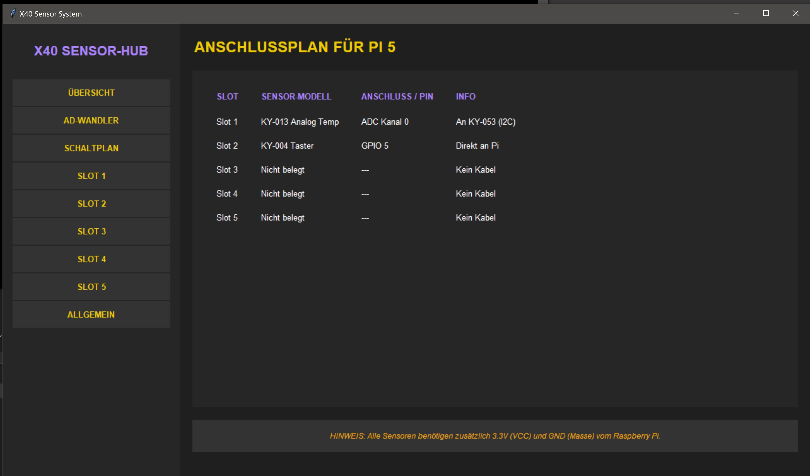

# X40 Sensor-Hub für Raspberry Pi 5

Ein modulares Framework zur dynamischen Auslesung und Visualisierung von Sensordaten aus dem **Joy-IT X40-Sensorkit**. Dieses Projekt wurde als Schulprojekt entwickelt und ist gezielt für die Nutzung mit einem **Touchscreen** am Raspberry Pi 5 optimiert.

## ✨ Features
* **Dynamisches Dashboard:** Sensoren können zur Laufzeit über die GUI ausgewählt und konfiguriert werden.
* **Touch-Optimiert:** Große interaktive Flächen und intuitive Menüführung ohne verschachtelte Untermenüs.
* **Integrierter Anschluss-Guide:** Die Software zeigt direkt an, welcher Sensor an welchen Pin (GPIO oder ADC) angeschlossen werden muss.
* **Echtzeit-Performance:** Dank Multithreading (Hintergrund-Thread für Sensoren) bleibt die GUI jederzeit reaktionsfähig.
* **Hardware-Abstraktion:** Einfache Integration von digitalen und analogen Sensoren via ADS1115 ADC.

| Live-Monitor | Anschluss-Guide |
| :---: | :---: |
|  |  |

## 🛠 Technische Details
* **Sprache:** Python
* **Architektur:** Modulare Ebenen (Präsentation, Logik, Hardware) für leichte Erweiterbarkeit.
* **Hardware:** Raspberry Pi 5, ADS1115 (KY-053) Analog-Digital-Wandler.
* **Besonderheit:** Anpassung an die neue **RP1-I/O-Architektur** des Pi 5 durch Nutzung moderner CircuitPython-Bibliotheken.

## 🚀 Installation & Start
1. Repository klonen.
2. Virtuelle Umgebung erstellen und aktivieren:
```bash
python -m venv venv
source venv/bin/activate  # Unter Windows: venv\Scripts\activate
```
3. Benötigte Bibliotheken installieren:
```bash
pip install gpiozero adafruit-circuitpython-ads1x15
```
4. Wichtig: Stelle sicher, dass der I2C-Bus an deinem Raspberry Pi aktiviert ist
```bash
sudo raspi-config
```
5.Programm starten:
```bash
python Main.py
```
## 📝 Lizenz
Dieses Projekt steht unter der **MIT-Lizenz** – "Soll jeder machen, was er will!"
